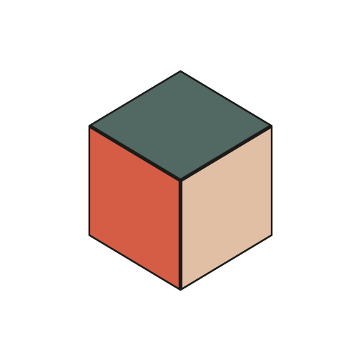

<div align="center">



# Cortex Studio

### Design, preview, refine, and export GTA V and FiveM liveries from one native desktop studio

Work directly with vehicle and EUP models, watch texture edits update in real time, generate layered templates, build PSD variants, and capture polished previews without breaking your creative flow.

[](https://github.com/IEver3st/cortex-labs/releases/latest)
[](https://github.com/IEver3st/cortex-labs/releases)
[](https://github.com/IEver3st/cortex-labs/stargazers)
[](https://github.com/IEver3st/cortex-labs/releases/latest)
[](https://tauri.app/)
[](./LICENSE)

[Official product page](https://frommeans.com/cortex/cortex-studio) · [Download Cortex Studio](https://github.com/IEver3st/cortex-labs/releases/latest) · [Read the guide](./docs/site/content/docs/index.mdx) · [Report a problem](https://github.com/IEver3st/cortex-labs/issues/new) · [View changelog](./CHANGELOG.md) · [Support on Ko-fi](https://ko-fi.com/C1C41TSVBX)

**Spend less time exporting and loading. Spend more time designing.**

</div>

## Overview

Cortex Studio is a Windows-first livery development environment for GTA V and FiveM. It combines a React workflow UI, real-time Three.js previews, native Rust file integration, and a CodeWalker bridge for supported game assets.

The core loop stays deliberately simple:

```text
Open a model → Load a texture → Edit in your preferred app → Save → See the preview update
```

Your models, textures, PSDs, PDNs, and project files remain authoritative. Cortex reads source assets and writes only to destinations you explicitly choose for captures, templates, or exports.

## Why Cortex Studio

Livery work is iterative, but repeated in-game testing turns small visual decisions into a slow cycle. Cortex Studio keeps the model, texture, materials, lighting, and camera in one responsive workspace so you can inspect changes as soon as you save them.

- **Immediate feedback** — native file watching reloads edited textures without reopening the project.
- **Format-aware previews** — work with GTA V vehicle and clothing models instead of generic stand-ins.
- **Focused workspaces** — choose the viewer or generator that matches the job in front of you.
- **Manual control** — automatic material targeting can suggest a useful starting point, while your explicit texture choices remain the final override.
- **Local workflow** — source assets and saved workspaces stay on your machine; network actions such as updates or feedback are explicit.

## Studio workspaces

| Workspace | Purpose |
| --- | --- |
| **Livery** | Target vehicle paint and livery materials for the fastest everyday preview loop. |
| **All Textures** | Apply a texture across the model or inspect experimental native material resolution. |
| **EUP** | Preview clothing and Emergency Uniform Pack assets from `.ydd` models. |
| **Multi-Model** | Compare two models side by side with independent texture controls. |
| **Template Generator** | Turn supported `.yft` and `.ydd` geometry into layered PSD or PNG templates. |
| **PSD Variant Builder** | Toggle PSD layers, manage visual variants, and batch-export finished PNGs. |

## Core capabilities

### Live 3D livery preview

Load a supported model and texture, then keep Cortex Studio open beside Photoshop, paint.net, or another editor. Native file watching detects saves and refreshes the material in the viewer, preserving the rapid edit-preview loop.

Viewer controls include:

- orbit and free-flight camera movement;
- quick camera angles and automatic framing;
- adjustable background, gloss, and light intensity;
- an interactive light dome for azimuth and elevation;
- per-slot vehicle colors for primary, secondary, accent, and glass materials;
- model shadows, cage wireframes, and persistent camera state.

### Template generation

Build paint-ready templates directly from vehicle and EUP geometry. The dedicated workbench provides Model, Template, and Split views, format-aware UV targeting, marker selection, a cage overlay, and layered export.

Multi-drawable `.ydd` dictionaries can export one template per drawable so unrelated UV layouts do not overlap.

### PSD variant workflow

Open layered Photoshop documents without flattening the creative structure. Cortex Studio preserves layer groups and visibility while you create named variants such as patrol, supervisor, high-visibility, or stealth editions.

Variants can be previewed on the model and exported together as high-resolution PNG files.

### Native material preview

Experimental Native Materials resolves available embedded, sibling, resource, and supported shared-game YTD textures for `.yft` assets. The system chooses the highest available LOD, deduplicates DDS work, and reports progress while loading.

This is a best-effort preview of GTA materials, not full shader parity. Manual texture selections always remain the final override on targeted meshes.

### Preview capture

Export clean presentation images from front, back, side, three-quarter, and top camera angles. Captures support zoom control and configurable text watermarks with font, color, opacity, placement, tiling, and rotation options.

### Workspace continuity

Cortex Studio remembers recent projects, pinned workspaces, model and texture paths, colors, camera positions, and interface preferences. Adjustable UI scale, custom hotkeys, light and dark themes, and 12 appearance presets keep the desktop comfortable across different displays and workflows.

## Supported files

### Models

| Format | Use |
| --- | --- |
| `.yft` | GTA V and FiveM vehicle models |
| `.ydd` | GTA V clothing and EUP drawable dictionaries |
| `.dff` | Legacy model support |
| `.clmesh` | Cortex Studio's internal binary mesh cache |

> [!NOTE]
> `.obj` is intentionally not supported. Cortex Studio focuses on format-aware GTA V and FiveM workflows.

### Textures and design files

- Photoshop: `.psd`
- Paint.NET: `.pdn`
- Common images: `.png`, `.jpg`, `.jpeg`, `.gif`, `.bmp`, `.webp`
- Game and production formats: `.dds`, `.tga`, `.tif`, `.tiff`, `.avif`
- Illustrator input: `.ai`

DDS support includes DXT1, DXT3, DXT5, BC4, BC5, BC7, and supported uncompressed layouts.

## What is new in 4.1 — PRISM

PRISM sharpens the entire edit-preview-export loop:

- **Appearance presets** — 12 complete workbench palettes with independent System, Light, and Dark choices.
- **EUP templates** — generate templates from `.ydd` assets with drawable-aware exports.
- **Rebuilt Template Generator** — switch between Model, Template, and Split views with tighter marker and camera controls.
- **Native materials** — preview supported game textures while retaining manual overrides.
- **Integrated feedback** — submit structured bug reports or feature requests from the app.
- **Clearer desktop workflows** — refined onboarding, Settings, viewer controls, lighting, sidebars, updates, and What's New.

See the [complete changelog](./CHANGELOG.md) for release history and implementation details.

## Installation

Cortex Studio targets Windows and is distributed through GitHub Releases.

1. Open the [latest release](https://github.com/IEver3st/cortex-labs/releases/latest).
2. Download the Windows installer.
3. Run the installer and launch Cortex Studio.
4. Choose a workspace and open a supported model.

The desktop app includes the native integrations required for dialogs, file watching, filesystem access, preview exports, and updates.

## Development

### Requirements

- [Bun](https://bun.sh/)
- [Rust](https://www.rust-lang.org/tools/install) with the stable toolchain
- [Tauri 2 prerequisites](https://v2.tauri.app/start/prerequisites/) for Windows
- .NET 10 SDK only when building the CodeWalker bridge from source

### Clone and install

```powershell
git clone https://github.com/IEver3st/cortex-labs.git
cd cortex-labs
bun install --frozen-lockfile
```

### Run the desktop app

```powershell
bun run tauri dev
```

For UI-only work in a browser:

```powershell
bun run dev
```

Browser mode does not provide native dialogs, file watching, sidecars, filesystem access, or updater behavior.

### Build

```powershell
bun run build
bun run tauri build
```

### Quality checks

```powershell
bun run test
bun run build
cargo fmt --manifest-path src-tauri/Cargo.toml --check
cargo check --manifest-path src-tauri/Cargo.toml
cargo clippy --manifest-path src-tauri/Cargo.toml
```

Focused test commands are also available for the CLMESH parser, native materials, PDN decoding, templates, camera behavior, updater state, and feedback payloads. See [`package.json`](./package.json) for the current scripts.

## Architecture

```text
cortex-labs/
├── src/
│   ├── components/            # React workspaces, viewers, and desktop UI
│   └── lib/                   # Parsers, materials, capture, templates, and state
├── src-tauri/
│   ├── src/                   # Rust commands and native integration boundary
│   ├── capabilities/          # Tauri permissions
│   └── icons/                 # Application branding and platform icons
├── tools/
│   └── codewalker-bridge/     # .NET asset conversion sidecar
├── docs/
│   ├── site/                  # Next.js and Fumadocs documentation project
│   └── yft-cli-contract.md    # Sidecar and cache contract
├── CHANGELOG.md               # Release history
└── package.json               # Bun scripts and frontend dependencies
```

### Desktop stack

| Layer | Technology |
| --- | --- |
| Desktop runtime | Tauri 2 |
| Native integration | Rust |
| Interface | React 19 |
| Real-time preview | Three.js |
| Styling | Tailwind CSS 4 and CSS custom properties |
| Motion | Motion for React |
| Component primitives | Radix UI |
| Frontend build | Vite 7 |
| Package manager | Bun |
| Asset bridge | .NET 10 and CodeWalker.Core |

## Privacy and asset safety

Cortex Studio is designed around local, user-directed work:

- source models, textures, PSDs, and PDNs are never silently overwritten, moved, renamed, or deleted;
- caches and exports are written to explicit derived destinations;
- local workspaces and preferences remain on the machine;
- malformed or unsupported inputs are rejected instead of being reinterpreted as plausible output;
- feedback submission is user-initiated and lets you choose whether recent diagnostic logs are included;
- private credentials do not belong in the renderer or any `VITE_*` configuration value.

## Contributing

Contributions are welcome, especially when they improve format fidelity, viewer responsiveness, desktop reliability, or the clarity of the creative workflow.

A strong contribution should:

1. preserve user-owned source assets and explicit manual choices;
2. include a focused regression test for parser, material, or template changes;
3. verify the native boundary when dialogs, files, watches, sidecars, or exports change;
4. update user or contract documentation when shipped behavior changes;
5. avoid broad cleanup unrelated to the change.

Open an issue before starting a large workflow or format change so the compatibility and integration surface can be discussed.

## Reporting problems

When opening a bug report, include:

- the Cortex Studio version and Windows version;
- the affected workspace and file format;
- clear reproduction steps;
- expected and actual behavior;
- a non-sensitive sample asset when redistribution is permitted;
- redacted diagnostics when they help explain the failure.

Do not publish credentials, paid assets, or proprietary source files in an issue.

## License

Cortex Studio is source-available under the [PolyForm Noncommercial License 1.0.0](./LICENSE). Copying, modifying, distributing, or using Cortex Studio for commercial purposes requires a separate written license from the licensor.

## Disclaimer

Cortex Studio is an independent community project. It is not affiliated with or endorsed by Rockstar Games, Take-Two Interactive, or Cfx.re.

FiveM, Grand Theft Auto V, and related names and assets belong to their respective owners.

---

<div align="center">

Built for the moment between saving the texture and seeing it come alive.

</div>
